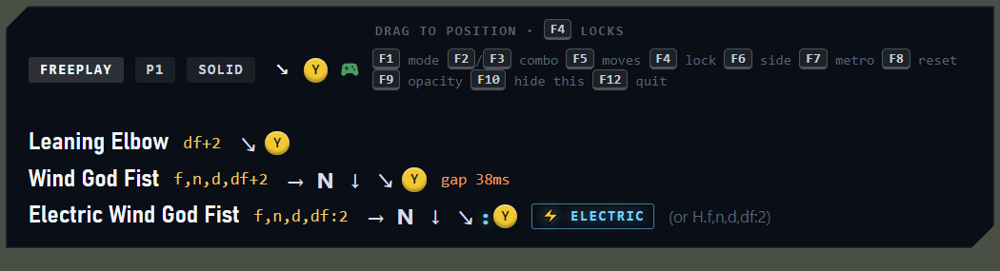
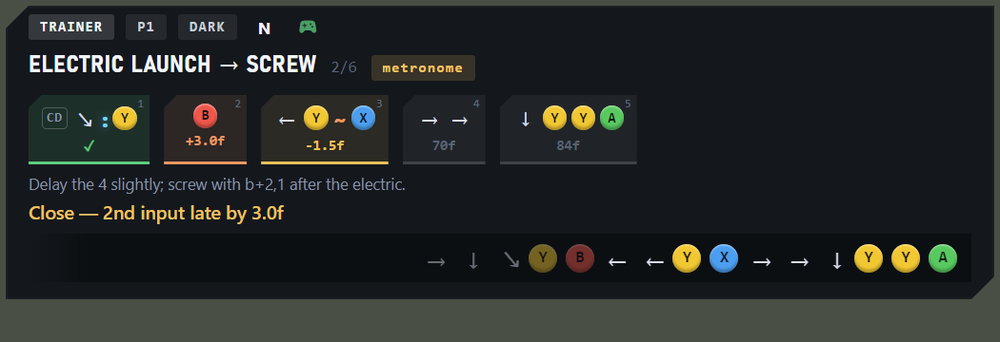
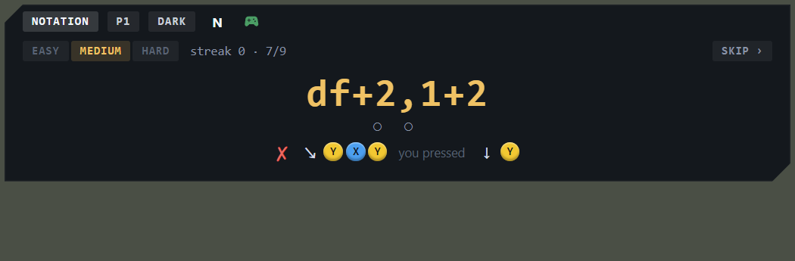
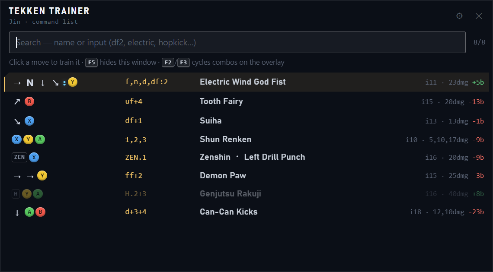
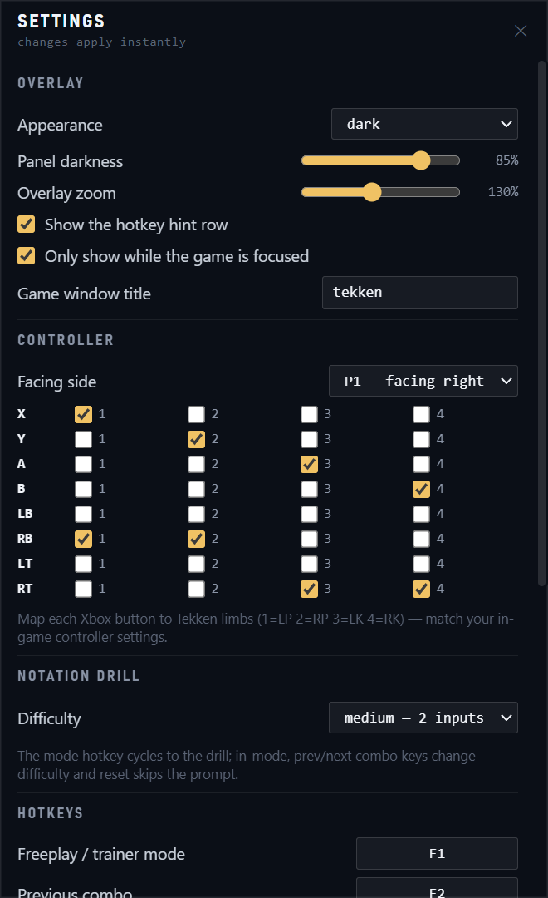

# tekken-trainer

A training overlay for **Tekken 8 (PC/Steam)** focused on **Jin**. Reads your
Xbox controller, recognizes moves from Jin's full command list, and coaches
combo timing — including telling you whether your Wind God Fist was **Electric**.

## Screenshots

*Captured from the visual preview harness — move data shown is illustrative.*

**Freeplay** — recognized moves tick past with notation and button icons:



**Trainer** — numbered input cards with per-step timing verdicts and input history:



**Notation drill** — read the notation, input it on the pad; misses reveal the answer:



**Move browser** — searchable command list; click a move to drill it:



**Settings** — everything configurable, applied live:



## Safety

This app **never touches the game**: no memory reading, no injection, no hooks,
no file modification. It reads the Windows gamepad API (XInput) and draws its
own transparent window — the same category as the Discord or OBS overlay.
It's designed for **offline practice** use.

## Setup

```
npm install
npm start       # build + run
npm run dev     # run with hot reload — renderer changes (CSS/HTML/TS) apply live
```

Tekken 8 must run in **Borderless Windowed** (not exclusive fullscreen) for the
overlay to draw on top. Drag the overlay anywhere while unlocked (F4).

## Hotkeys (global)

All hotkeys are **editable** in `config/config.json` (`hotkeys` section, Electron
accelerator names like `F1` or `Ctrl+Shift+M`). The hint row in the overlay
reflects your configured keys; **F11** hides/shows it. Defaults:

| Key | Action |
|-----|--------|
| F1  | Cycle mode: freeplay → trainer → notation drill |
| F2 / F3 | Previous / next combo (notation drill: difficulty down / up) |
| F4  | Lock / unlock overlay (unlock to drag it) |
| F5  | Open / hide the move browser window |
| F6  | Flip facing side (P1 ↔ P2) — inputs are facing-relative |
| F7  | Metronome on/off (plays the combo's target rhythm) |
| F8  | Reset current attempt (notation drill: skip to a new prompt) |
| F9  | Cycle overlay appearance (solid → dark → glass → faint → ghost) |
| F10 | Quit |
| F11 | Hide / show the hotkey hint row |
| F12 | Open / hide the settings window |

Controller status is the small gamepad icon in the status bar: green =
connected, red = disconnected.

## Modes

- **Freeplay** — every move you perform shows in a fading ticker: name, Tekken
  notation, and labeled Xbox button icons. `≈` marks state-dependent moves
  (stance/heat) matched by input alone. For Wind God Fist inputs you'll see
  `⚡ ELECTRIC` or your `df→2` gap in ms.
- **Trainer** — pick a combo (F2/F3) or any move from the **move browser**
  (F5): a compact, searchable version of the in-game move list (search "df2",
  "hopkick", "electric"…). Click a move and it becomes the active drill —
  single hits count successes, strings light up per hit and report the frame
  gaps between hits, just-frame moves get Electric detection. Each input is a
  card showing arrows + labeled Xbox buttons (Tekken notation alongside);
  after an attempt, cards color green/yellow/orange/red with per-input timing
  deltas in frames. A Tekken-style **input history strip** shows exactly what
  you pressed. The metronome (F7) plays sequence combos' target rhythm.
- **Notation drill** — learn to *read* Tekken notation: the overlay shows a
  random command as notation text only (`df+2`, `b+1+2,4`, …) and you input it
  on the pad. Correct = ✓ and the next prompt; wrong = the answer is revealed
  as button icons next to what you actually pressed, and the same prompt
  repeats until you land it. Tracks streak and accuracy. Difficulty sets the
  string length: easy 1 input, medium 2, hard 3 — click the difficulty
  buttons in the pane (or F2/F3 in-game, or Settings); **skip** gets a new
  prompt (F8).
  Neutral matters — `2` means *neutral* 2, holding a direction fails it, just
  like the game.

## Settings

**F12** (or the ⚙ button in the move browser) opens the settings window:
overlay appearance/zoom, game-focus behavior, controller binds, facing side,
and every hotkey — changes apply instantly and persist. The same values live
in `config/config.json` if you prefer editing JSON (details below); a few
low-level ones (window position/size, appearance preset list) are JSON-only.

## Packaging

`npm run dist` builds a Windows installer into `release/` (via
electron-builder); `npm run pack` builds an unpacked folder for a quick check.
A packaged install keeps its config in `%APPDATA%/tekken-trainer` instead of
the repo's `config/` folder.

## Data & config

- `data/jin.json` — Jin's full move list (128 moves), fetched from the
  [Wavu wiki](https://wavu.wiki). Refresh after balance patches: `npm run fetch-data`.
- `data/combos.json` — training combos. **Juggle timings are approximate
  starting points** — lab them and edit the `ideal` frame offsets to match
  what actually connects. Add your own combos here.
- `data/stances.json` — stance-entry moves (enables ZEN.x recognition after f+3).
- `config/config.json` — button binds (match your in-game settings), facing
  side, and overlay appearance. Default binds: X=1 (LP), Y=2 (RP), A=3 (LK),
  B=4 (RK). Overlay settings:
  - `width`/`height` — window size; you can also just drag the overlay's edges
    while unlocked (F4), and the size is remembered.
  - `scale` — zooms everything in the overlay (e.g. `1.3` on a high-DPI screen).
  - `panelAlpha` — how dark the glass panel is, `0`–`1` (`1` = fully solid).
  - `onlyOverGame` — when `true`, the overlay only shows while the game window
    is focused (alt-tab away and it hides; the move browser doesn't count as
    leaving). Off by default so the overlay is visible on first run. Uses the
    foreground window's *title* — set `gameTitle` if yours doesn't contain
    "tekken". Note: with this on and the game closed, the overlay is hidden.
  - `appearancePresets` — the cycle F9 walks through; each preset names a
    combination of window opacity and glass darkness. Defaults run from
    `solid` (fully opaque) to `ghost`; add or edit presets freely. The status
    bar pill shows the active preset's name.

## Known limits (by design)

- The app sees what you **pressed**, not what the game did — it can't know if
  a move whiffed, was blocked, or if a juggle actually connected.
- Facing is assumed (F6 flips it); sidestep-relative inputs aren't tracked.
- Stance moves (ZEN.x) are inferred from your recent inputs and marked `≈`.
- Positional throws (Left/Right/Back throw) can't be recognized from input.

## Tests

`npm run test-engine` — compiles the full move list (123/128 recognizable; the
5 skips are positional throws and pure-movement entries) and runs synthetic
input scenarios through the recognizer, including Electric vs regular WGF.

## Changelog

See [CHANGELOG.md](CHANGELOG.md).

## License

GPL-3.0 — see [LICENSE](LICENSE).
